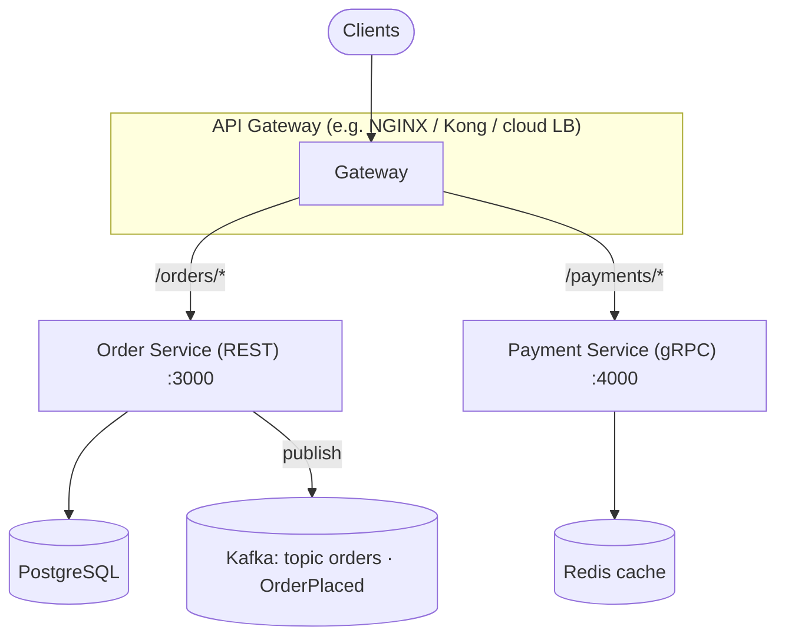

# 🧩 Microservices Cheat Sheet

**Microservices** architecture splits an application into **small, independently deployable services** that communicate over **APIs** (sync) and/or **events** (async). Goals: **scalability**, **team autonomy**, and **faster delivery**—at the cost of **distributed-system complexity**.

> [!NOTE]
> Microservices are a **trade-off**, not a default. Start modular **monolith** unless you have clear scaling/organizational drivers.

---

## 🎯 Design Principles

| Principle | Description | Example |
| :--- | :--- | :--- |
| **Single responsibility** | Each service owns one business capability end-to-end | `order-service` handles orders only |
| **Independent deployability** | Release one service without redeploying the whole system | Ship `payment-service` without stopping `user-service` |
| **Stateless processes** | App instances don’t rely on local memory for session state; persist externally | Session data in **Redis**; uploads in **object storage** |
| **Lightweight communication** | Prefer simple protocols; avoid chatty, heavy RPC stacks when unnecessary | **HTTP/REST**, **gRPC**, or **async messaging** |
| **Database per service** | No shared DB schema across teams/services; integrate via APIs/events | `orders` → PostgreSQL, `users` → MongoDB (by choice, not accidental sharing) |

> [!WARNING]
> **“Database per service”** is about **ownership and coupling**, not “every service must use a different DB product.” Sharing a **DB server** can be OK; sharing **tables/schema** across services usually creates tight coupling.

---

## 🛠️ Common Tools & Technologies

| Tool / Area | Purpose | Example |
| :--- | :--- | :--- |
| **Docker** | Package a service + deps as an immutable image | `docker run -d --name order order-service:1.0` |
| **Kubernetes** | Orchestrate containers: scheduling, scaling, rollouts | `kubectl apply -f deployment.yaml` |
| **API Gateway** (Kong, NGINX, Envoy, cloud gateways) | Routing, authN/Z, rate limits, TLS termination | Route `/orders/*` → `order-service` |
| **Message broker** (RabbitMQ, NATS, **Kafka**, Pulsar) | Async integration, buffering, event streaming | Publish `OrderCreated` to a topic |
| **Service mesh** (Istio, Linkerd) | mTLS, traffic policy, observability without app code changes | Retry/timeout policies per route |
| **Prometheus + Grafana** | Metrics + dashboards | `rate(http_requests_total[5m])` |
| **OpenTelemetry + Jaeger/Tempo** | Distributed tracing | Trace a request across Order → Payment → Inventory |
| **ELK / OpenSearch / Loki** | Centralized logging | Correlate by `trace_id` |

---

## 🚀 Deployment Examples

### Dockerfile (Node.js service)

```dockerfile
FROM node:20-alpine
WORKDIR /app

# Leverage layer caching
COPY package*.json ./
RUN npm ci --omit=dev

COPY . .
EXPOSE 3000

USER node
CMD ["node", "server.js"]
```

**What it does:** builds a minimal runtime image, installs deps reproducibly (`npm ci`), exposes **3000**.

> [!TIP]
> Prefer **small base images** (`alpine`/`distroless`), run as **non-root**, and scan images in CI (**Trivy**, **Grype**).

---

### Kubernetes `Deployment` (3 replicas)

```yaml
apiVersion: apps/v1
kind: Deployment
metadata:
  name: order-service
spec:
  replicas: 3
  selector:
    matchLabels:
      app: order
  template:
    metadata:
      labels:
        app: order
    spec:
      containers:
        - name: order
          image: order-service:1.0
          ports:
            - containerPort: 3000
          readinessProbe:
            httpGet:
              path: /health/ready
              port: 3000
          livenessProbe:
            httpGet:
              path: /health/live
              port: 3000
```

**What it does:** runs **3 pods** with rolling updates; probes keep bad versions from taking traffic.

> [!NOTE]
> You still need a **`Service`** (ClusterIP/LoadBalancer) and usually an **Ingress** or Gateway for external access.

---

## 🔌 Service Communication

| Style | Description | Pros | Cons |
| :--- | :--- | :--- | :--- |
| **REST over HTTP** | Sync request/response, JSON common | Simple, ubiquitous, easy to debug | Chatty chains increase latency; versioning discipline needed |
| **gRPC** | Binary contracts (often **Protobuf**), HTTP/2 | Fast, strong typing, streaming | Tooling/ops slightly heavier; browser clients need a gateway |
| **Message queue / log** | Async producer/consumer | Decoupling, buffering, resilience | Harder mental model; idempotency + ordering concerns |
| **Event-driven integration** | Publish facts; consumers react | Loose coupling at scale | Requires schema governance (**AsyncAPI**, registries) |
| **Event sourcing** | Store events as the system of record; derive state | Auditability, time travel (when needed) | Complexity; not every domain fits |

> [!IMPORTANT]
> Prefer **async** for cross-service workflows that don’t need an immediate answer; keep **sync** for user-facing paths where latency matters—often behind a **BFF** or gateway.

---

## 🗄️ Data Management Patterns

| Technique | Description | Example |
| :--- | :--- | :--- |
| **Database per service** | Each service owns its data model and migrations | `payment` uses MySQL; `inventory` uses DynamoDB |
| **CQRS** | Split **write model** vs **read model** | Writes to PostgreSQL; reads from Elasticsearch projection |
| **Saga** | Distributed workflow as steps + compensations | **Choreography** (events) vs **orchestration** (central coordinator) |
| **Eventual consistency** | System becomes consistent after propagation | Stock updates after order commit + async processing |
| **Outbox pattern** | Write DB + “outbox” row in one transaction; relay publishes reliably | Avoids “dual write” to DB and broker |
| **Strangler / anti-corruption layer** | Gradually replace legacy; translate at boundaries | New service fronts old system during migration |

---

## 🩺 Monitoring & Troubleshooting

| Tool / Command | Description | Example |
| :--- | :--- | :--- |
| `docker logs <container>` | Container stdout/stderr | `docker logs -f order-service` |
| `kubectl get pods` | Pod status overview | `kubectl get pods -n prod -o wide` |
| `kubectl describe pod <name>` | Events (image pull, probe failures, scheduling) | Debug crash loops |
| `kubectl logs <pod>` | Kubernetes workload logs | `kubectl logs deploy/order-service --tail=200` |
| **PromQL** | Metrics queries | `histogram_quantile(0.99, sum(rate(http_request_duration_seconds_bucket[5m])) by (le))` |
| **Distributed tracing** | End-to-end latency breakdown | Find slow span between Order → Payment |
| **SLOs / error budgets** | Operate from user-visible reliability | p99 latency + availability targets |

---

## 🏗️ Practical System Sketch



> [!NOTE]
> **Mermaid** renders on **GitHub**, **GitLab**, and many Markdown viewers. If yours does not, use the bullet list below as the text fallback.

- **Order Service:** REST, PostgreSQL, port **3000**
- **Payment Service:** gRPC, Redis, port **4000**
- **Gateway:** routes paths to services; handles TLS/auth at the edge
- **Kafka:** async fan-out (notifications, analytics, inventory)

---

## 🐳 Docker Compose (local / demo)

```yaml
services:
  order:
    image: order-service:1.0
    ports:
      - "3000:3000"
    environment:
      DB_HOST: postgres
    depends_on:
      - postgres

  payment:
    image: payment-service:1.0
    ports:
      - "4000:4000"
    environment:
      REDIS_HOST: redis
    depends_on:
      - redis

  postgres:
    image: postgres:16
    environment:
      POSTGRES_USER: order
      POSTGRES_PASSWORD: secret
      POSTGRES_DB: orders

  redis:
    image: redis:7
```

**What it does:** runs Order + Payment with **separate backing stores** suitable for local development.

> [!NOTE]
> `depends_on` does **not** wait for DB readiness; use **healthchecks** or init jobs for serious local stacks.

---

## ✅ Production Tips (Reliability & Ops)

| Topic | What to do |
| :--- | :--- |
| **Circuit breaker / bulkhead** | Stop retry storms; isolate failures (**Resilience4j**, **Polly**, Envoy/mesh policies). *Netflix Hystrix is maintenance mode—prefer modern libs.* |
| **Health checks** | Expose **`/health/live`** (process up) and **`/health/ready`** (deps OK) for orchestrators |
| **Timeouts + retries** | Always set budgets; retries must be **idempotent** |
| **Idempotency keys** | For payments/orders, accept duplicate submits safely |
| **Centralized logging** | Structured JSON logs + **correlation/trace IDs** |
| **CI/CD rollback** | Keep **previous image** ready; use **blue/green** or **canary** with automated promotion |
| **Chaos engineering** | Inject failures in non-prod (and carefully in prod) to validate assumptions |
| **Contract testing** | **Pact** / schema tests for producer/consumer APIs |
| **Security** | mTLS or strong auth between services; secrets from vault/CSI; least privilege |

---

## 📌 Quick Reference

| Need | Pattern / Tool |
| :--- | :--- |
| Public HTTP API | Gateway + REST/OpenAPI |
| Internal high-performance RPC | gRPC + Protobuf |
| Decouple services | Events + broker (Kafka/RabbitMQ) |
| Distributed transactions | Saga (choreography/orchestration), avoid 2PC |
| Read scaling / search | CQRS projections (e.g., ES/OpenSearch) |
| Observability baseline | Logs + metrics + traces (OpenTelemetry) |

---

*Use this sheet as a **checklist** when designing boundaries, choosing sync vs async, and planning deploy/operate workflows.*
